# Tugas Pemrograman Berbasis Kerangka Kerja

| Nama              | NRP        | Kelas  |
|-------------------|------------|--------|
| Wan Sabrina Mayzura| 5025211023 | PBKK D |

Proyek ini dibuat menggunakan Laravel dan Blade untuk membangun sebuah website dengan komponen UI yang modular. Berikut adalah penjelasan dari setiap komponen dan layout yang digunakan dalam website ini.

<details>
<summary> Teknologi yang digunakan </summary>

- **Laravel 11**: Framework PHP modern untuk pengembangan web.
- **Laragon**: Alat setup dan manajemen lingkungan pengembangan Laravel di Windows.
- **PHP**: Bahasa pemrograman untuk scripting server-side.
- **Composer**: Manajer paket yang mengatur dependensi PHP dalam proyek.
- **Tailwind CSS**: Framework CSS untuk desain antarmuka.
- **Alpine.js**: Framework JavaScript untuk penambahan interaktivitas pada web.
</details>
<details>
<summary>Langkah-Langkah Menjalankan Proyek Laravel dengan Laragon</summary>

1. **Start Laragon**: Buka Laragon dan klik `Start All` untuk memulai semua layanan seperti Nginx dan MySQL.
2. **Buka Terminal dari Laragon**: Navigasikan ke direktori proyek Anda menggunakan `cd Laravel-Project`.
3. **Jalankan Server Laravel**: Ketik `php artisan serve` di terminal untuk memulai server pengembangan Laravel.
4. **Kompilasi Aset**: Jalankan `npm run dev` untuk mengkompilasi aset JavaScript dan Tailwind CSS.
5. **Buka di Browser**: Akses aplikasi di browser dengan membuka `http://localhost:8000`.
</details>

## Daftar Isi
1. [Section 2](#2️⃣-section-2)
2. [Section 3](#3️⃣-section-3)
3. [Section 4](#4️⃣-section-4)
3. [Section 5](#5️⃣-section-5)

## 2️⃣ Section 2
#### Daftar Isi
1. [Layout Utama](#layout-utama)
   - [Navbar](#navbar)
   - [Header](#header)
2. [Halaman Web](#halaman-web)
   - [Home](#home)
   - [Blog](#blog)
   - [About](#about)
   - [Contact](#contact)

>### Layout Utama
Layout utama digunakan sebagai kerangka dasar untuk semua halaman dalam website. Layout ini mengintegrasikan komponen-komponen seperti navbar, header, dan main, di mana slot main digunakan sebagai tempat penempatan konten halaman sebenarnya. Slot ini memungkinkan konten yang spesifik untuk masing-masing halaman dapat disisipkan secara dinamis berdasarkan kebutuhan halaman tersebut.

```html
<!DOCTYPE html>
<html lang="en" class="h-full bg-gray-100">
<head>
    <meta charset="UTF-8">
    <meta name="viewport" content="width=device-width, initial-scale=1.0">
    @vite('resources/css/app.css')
    <link rel="stylesheet" href="https://rsms.me/inter/inter.css">
    <script defer src="https://cdn.jsdelivr.net/npm/alpinejs@3.x.x/dist/cdn.min.js"></script>
    <title>{{ $title }}</title>
</head>
<body class="h-full">
    <div class="min-h-full">
        <x-navbar></x-navbar>
        <x-header>{{ $title }}</x-header>
        <main>
            <div class="mx-auto max-w-7xl px-4 py-6 sm:px-6 lg:px-8">
                {{ $slot }}
            </div>
        </main>
    </div>
</body>
</html>
```

- #### Navbar
    

    Komponen `navbar` berfungsi untuk navigasi antar halaman. Navbar ini responsif dan menyediakan dropdown menu untuk akses cepat ke profil pengguna. Komponen ini dibangun menggunakan Tailwind CSS dan Alpine.js.

    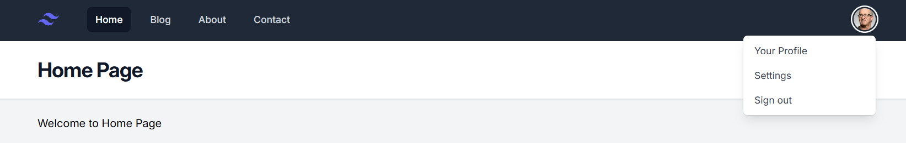

    Komponen x-nav-link membuat tautan navigasi yang aktif sesuai dengan halaman yang sedang dikunjungi. Atribut :active membandingkan URL saat ini dengan target untuk menentukan tautan aktif. 
    ```html
    <x-nav-link href="/" :active="request()->is('/')">Home</x-nav-link>
    <x-nav-link href="/posts" :active="request()->is('posts')">Blog</x-nav-link>
    <x-nav-link href="/about" :active="request()->is('about')">About</x-nav-link>
    <x-nav-link href="/contact" :active="request()->is('contact')">Contact</x-nav-link>
    ```

- #### Header
    

    `Header` menampilkan judul halaman yang sedang aktif. Ini menyesuaikan isi berdasarkan halaman yang dikunjungi dan didefinisikan secara dinamis melalui `slot`.
    ```html
    <header class="bg-white shadow">
        <div class="mx-auto max-w-7xl px-4 py-6 sm:px-6 lg:px-8">
            <h1 class="text-3xl font-bold tracking-tight text-gray-900">{{ $slot }}</h1>
        </div>
    </header>
    ```

>### Halaman Web

- #### Home
    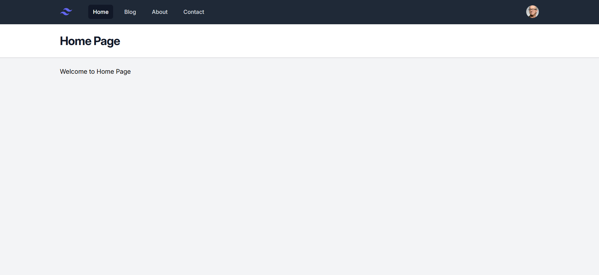

    Halaman `Home` memberikan pengantar singkat kepada pengunjung tentang website. Komponen ini menggunakan layout utama dan mengisi slot konten dengan teks sambutan.

    ```html
    <x-layout>
        <x-slot:title>{{ $title }}</x-slot:title>
        <h3>Welcome to Home Page</h3>
    </x-layout>
    ```

    **Route**: Halaman ini diakses melalui rute `/` yang mengembalikan view `home` dengan judul 'Home Page'.

    ```php
    Route::get('/', function () {
        return view('home', ['title' => 'Home Page']);
    });
    ```

- #### Blog
    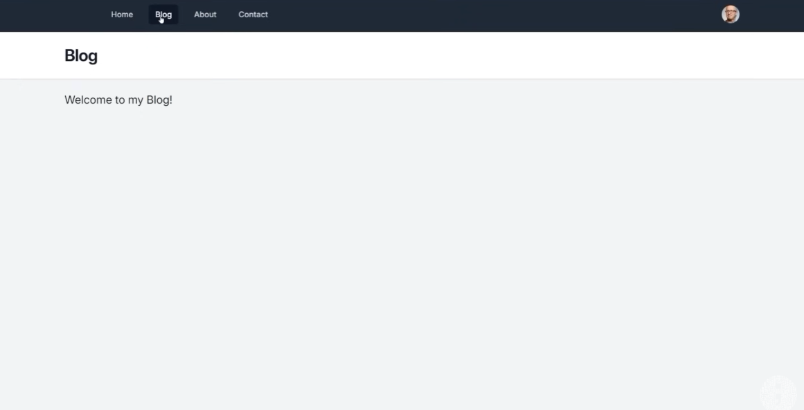

    Halaman `Blog` ini akan diisi dengan artikel atau postingan oleh pembuat website.

    ```html
    <x-layout>
        <x-slot:title>{{ $title }}</x-slot:title>
        <h3>Welcome to my Blog</h3>
    </x-layout>
    ```

    **Route**: Rute `/blog` mengarahkan ke halaman ini, mengembalikan view `blog` dengan judul 'Blog'.

    ```php
    Route::get('/blog', function () {
        return view('blog', ['title' => 'Blog']);
    });
    ```

- #### About
    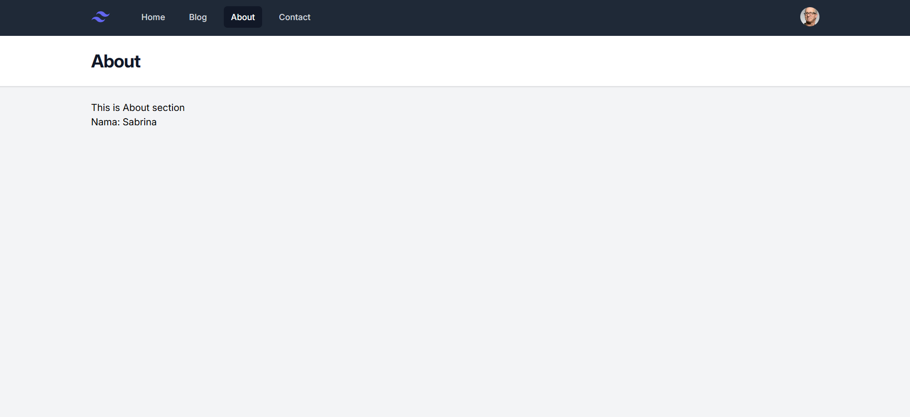

    Halaman `About` memberikan informasi tentang pembuat atau tujuan website. Ini juga mengambil nama dari variabel yang diberikan dan menampilkan dalam konten.

    ```html
    <x-layout>
        <x-slot:title>{{ $title }}</x-slot:title>
        <h3>This is About section</h3>
        <p>Nama: {{ $name }}</p>
    </x-layout>
    ```

    **Route**: Rute `/about` membawa pengunjung ke halaman ini, mengembalikan view `about` dengan informasi nama dan judul.

    ```php
    Route::get('/about', function () {
        return view('about', ['name'=> 'Sabrina', 'title' => 'About']);
    });
    ```

- #### Contact
    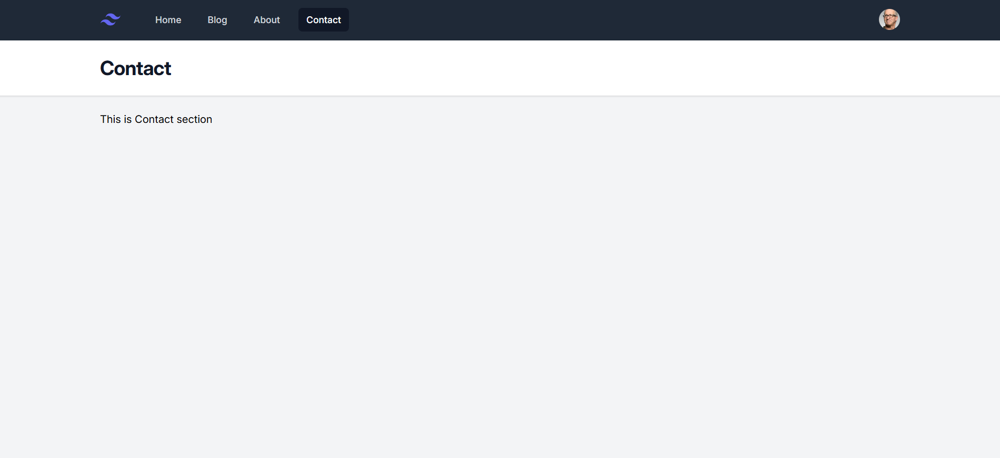

    Halaman `Contact` menyediakan informasi kontak atau formulir untuk menghubungi pembuat website.

    ```html
    <x-layout>
        <x-slot:title>{{ $title }}</x-slot:title>
        <h3>This is Contact section</h3>
    </x-layout>
    ```

    **Route**: Halaman `Contact` dapat diakses melalui rute `/contact` yang mengembalikan view `contact` dengan judul 'Contact'.

    ```php
    Route::get('/contact', function () {
        return view('contact', ['title' => 'Contact']);
    });
    ```

## 3️⃣ Section 3
#### Daftar Isi
1. [View Data and UI Update (Blog)](#view-data-and-ui-update-blog)
2. [Model](#model)
   - [Menampilkan Halaman 404](#menampilkan-halaman-404)

>### View Data and UI Update (Blog)

Pada halaman blog, akan ditampilkan daftar artikel yang diambil dari data dummy/array `post` yang telah didefinisikan sementara di file routing `web.php`, dan setiap artikel dapat diklik untuk membuka halaman detailnya.

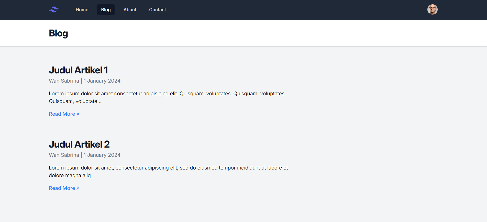

Pada slot layout untuk page Blog, digunakan direktif `@foreach` untuk mengiterasi setiap item dalam array `$posts`. Setiap item merepresentasikan satu artikel dari database, dengan struktur data yang didefinisikan dalam model `Post`.

```html
<x-layout>
    <x-slot:title>{{ $title }}</x-slot:title>

    @foreach ($posts as $post)
    <article class="py-8 max-w-screen-md border-b border-grey-300">
        <a href="/posts/{{ $post['slug'] }}" class="hover:underline">
            <h2 class="mb-1 text-3xl tracking-tight font-bold text-gray-900">{{ $post['title'] }}</h2>
        </a>
        <div class="text-base text-gray-500">
            <a href="#">{{ $post['author'] }}</a> | 1 January 2024
        </div>
        <p class="my-4 font-light">
            {{ Str::limit($post['body'], 120) }}
        </p>
        <a href="/posts/{{ $post['slug'] }}" class="font-medium text-blue-500">Read More &raquo;</a>
    </article>
    @endforeach
</x-layout>
```

Pada loop di atas, `slug` adalah versi sederhana dari judul artikel, yang ditulis dengan huruf kecil dan dihubungkan dengan tanda strip (-). Hal ini memudahkan URL untuk dibaca dan diingat. Penggunaan slug alih-alih ID numerik meningkatkan keamanan dan SEO, karena slug yang diambil dari judul artikel lebih sulit ditebak dan memperbaiki struktur URL.

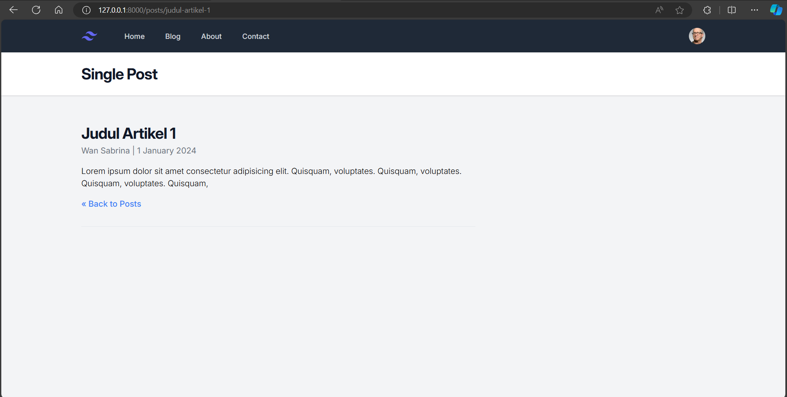

>### Model

Model `Post` terletak di direktori `App\Models` dan menyediakan metode untuk mengakses data artikel. Pemisahan data ke model ini mengikuti prinsip MVC (Model-View-Controller), di mana `Model` menangani data, `View` menampilkan data, dan `Controller` menghubungkan keduanya. Awalnya, data dapat ditempatkan langsung di dalam file rute (`web.php`), namun memindahkannya ke model memungkinkan kode lebih reusable dan mengoptimalkan pemisahan tanggung jawab.

Isi file `Post.php`
```php
<?php 

namespace App\Models;
use Illuminate\Support\Arr;

class Post
{
    public static function all()
    {
        return [
            [
                'id' => '1',
                'slug' => 'judul-artikel-1',
                'title' => 'Judul Artikel 1',
                'author' => 'Wan Sabrina',
                'body' => 'Lorem ipsum...'
            ],
            [
                'id' => '2',
                'slug' => 'judul-artikel-2',
                'title' => 'Judul Artikel 2',
                'author' => 'Wan Sabrina',
                'body' => 'Lorem ipsum...'
            ],
        ];
    }
}
```
Penggunaan `namespace` seperti `namespace App\Models;` membantu dalam mengorganisir kode secara logis dan menghindari konflik nama. Di Laravel, `namespace` memungkinkan kita untuk mengelompokkan kelas yang berhubungan (misalnya model atau controller) ke dalam direktori tertentu yang memudahkan manajemen kode dan autoloading.

Selain itu untuk memisahkan tanggung jawab pengolahan data dari logika routing dan menyederhanakan akses data pada aplikasi, fungsi untuk mengakses masing masing post yang awalnya berada di dalam file routing seperti berikut:

```php
Route::get('/posts/{slug}', function ($slug) {
    $post = Arr::first(Post::all(), function ($post) use ($slug) {
        return $post['slug'] == $slug;
    });

    return view('post', ['title' => 'Single Post', 'post' => $post]);
});
```

Sebaiknya dipindahkan dari rute `web.php` ke dalam class `Post` atau file `Post.php`, seperti ini:

```php
public static function find($slug) {
    return Arr::first(static::all(), function ($post) use ($slug) {
        return $post['slug'] == $slug;
    });
}
```

Selain itu, juga bisa menggunakan arrow function untuk mempersingkat syntax:

```php
return Arr::first(static::all(), fn ($post) => $post['slug'] == $slug);
```

Setelah fungsi `find` dipindahkan ke dalam class `Post`, pada routing, bisa dipanggil sebagai berikut:

```php
Route::get('/posts/{slug}', function ($slug) {
    $post = Post::find($slug);

    return view('post', ['title' => 'Single Post', 'post' => $post]);
});
```

#### Menampilkan halaman 404

Fungsi `find` dalam model `Post` bertugas mencari artikel berdasarkan `slug` yang diberikan. Jika artikel tidak ditemukan, Laravel akan menampilkan halaman error 404, memberitahukan bahwa sumber yang diminta tidak tersedia atau tidak ditemukan.
Sehingga pada fungsi `find` ditambahkan kondisi if else sebagai berikut:
```php
public static function find($slug): array {
    $post = Arr::first(static::all(), fn ($post) => $post['slug'] == $slug);

    if(!$post) {
        abort(404); // Memunculkan halaman error 404 jika tidak ada artikel yang cocok
    }

    return $post;
}
```

## 4️⃣ Section 4
#### Daftar Isi
1. [Database & Migration](#database--migration)
   - [Konfigurasi Database](#konfigurasi-database)
   - [Membuat Tabel Baru](#membuat-tabel-baru)
   - [Menjalankan Migration](#menjalankan-migration)
2. [Eloquent ORM & Post Model](#eloquent-orm--post-model)
   - [Menghubungkan Model dengan Tabel](#menghubungkan-model-dengan-tabel)
   - [Menyambungkan Model dan Tabel dengan Nama yang Berbeda](#menyambungkan-model-dan-tabel-dengan-nama-yang-berbeda)
   - [Mengatur Primary Key](#mengatur-primary-key)
   - [Mengganti Fungsi `find` dengan Eloquent Routing](#mengganti-fungsi-find-dengan-eloquent-routing)
   - [Menambahkan Data Menggunakan Tinker](#menambahkan-data-menggunakan-tinker)
   - [Operasi Lain yang Bisa Dilakukan di Tinker](#operasi-lain-yang-bisa-dilakukan-di-tinker)
   - [Membuat Model Beserta Migration Secara Otomatis](#membuat-model-beserta-migration-secara-otomatis)

>### Database & Migration

Pada section ini, kita akan mengonfigurasi database menggunakan SQLite atau MySQL.

- **SQLite**: Database berbasis file yang mudah digunakan.
- **MySQL**: Database server yang lebih kuat dan ideal untuk aplikasi yang lebih kompleks.

#### Konfigurasi Database

Pada file `.env`, jika menggunakan SQLite, konfigurasi database hanya perlu diisi seperti berikut:
```
DB_CONNECTION=sqlite
```
Jika menggunakan MySQL, hapus bagian yang ditandai sebagai komentar dan isi konfigurasi sebagai berikut:
```
DB_CONNECTION=mysql
DB_HOST=127.0.0.1
DB_PORT=3306
DB_DATABASE=pbkk_laravel
DB_USERNAME=root
DB_PASSWORD=
```

Untuk mengetes kedua jenis database, kita dapat menggunakan `TablePlus`. Tambahkan database baru dan lakukan migration dengan menjalankan perintah `php artisan migrate`. Setelah perintah ini dijalankan, masing-masing database akan berisi tabel-tabel yang telah didefinisikan dalam file migration yang ada di direktori `database` proyek kita.

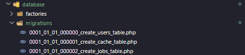

Pada database `PBKK_SQLite`, database akan otomatis terisi dengan tabel-tabel seperti berikut:

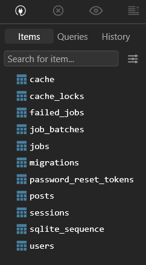

#### Membuat Tabel Baru

Untuk project ini, kita akan menggunakan SQLite karena lebih cocok untuk struktur project yang sederhana. Pada section sebelumnya, kita telah membuat post dengan data yang masih di-hardcode. Sekarang, kita akan membuat tabel baru untuk menyimpan data post ini.

Di terminal, jalankan perintah berikut untuk membuat tabel `create_posts_table`:
```
php artisan make:migration create_posts_table
```

Setelah menjalankan perintah tersebut, file migration baru akan muncul di dalam direktori `database/migrations`. Buka file tersebut dan isi struktur tabelnya seperti ini sesuai dengan struktur data dari model post yang telah dibuat sebelumnya:

```php
return new class extends Migration
{
    /**
     * Run the migrations.
     */
    public function up(): void
    {
        Schema::create('posts', function (Blueprint $table) {
            $table->id();
            $table->string('title');
            $table->string('author');
            $table->string('slug')->unique();
            $table->text('body');
            $table->timestamps();
        });
    }

    /**
     * Reverse the migrations.
     */
    public function down(): void
    {
        Schema::dropIfExists('posts');
    }
};
```

#### Menjalankan Migration

Setelah mengedit file migration, jalankan perintah berikut di terminal untuk menjalankan migrasi dan meng-update database:
```
php artisan migrate:fresh
```
Perintah ini akan menghapus semua tabel yang ada dan menjalankan ulang semua migration, termasuk migration baru yang kita buat.

Setelah menjalankan migration, tabel `posts` akan muncul di dalam database dengan struktur seperti berikut, dan bisa mengisi data/row dari tabel `posts` dengan data yang telah dibuat sebelumnya.

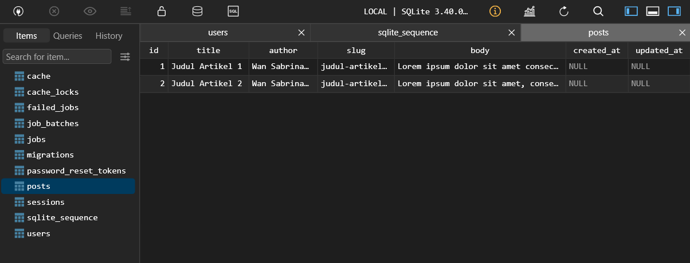 

>### Eloquent ORM & Post Model
Eloquent ORM adalah fitur bawaan Laravel yang memungkinkan kita untuk memetakan tabel di dalam database ke dalam bentuk objek. Setiap tabel di dalam database memiliki model yang berkorespondensi, dan model ini yang akan kita gunakan untuk berinteraksi dengan tabel tersebut. Model ini akan mempermudah kita dalam melakukan berbagai operasi pada database tanpa harus menulis query SQL secara manual.

#### Menghubungkan Model dengan Tabel

Kita sudah memiliki tabel `posts` di dalam database `PBKK_SQLite`, dan sebelumnya kita telah membuat file model `Post.php` di direktori `app/Models`. File tersebut awalnya berisi method statis `all` dan `find` untuk mencari single post berdasarkan slug.

Namun, dengan menggunakan Eloquent ORM, kita bisa langsung menghubungkan model `Post` dengan tabel `posts`. Secara default, Laravel akan otomatis menyambungkan model dengan tabel yang memiliki nama jamak dari model tersebut.

Untuk membuat model `Post` dengan cara yang benar, kita perlu menambahkan `extends Model` agar model tersebut mewarisi perilaku dari Eloquent Model. Caranya cukup dengan menambahkan `use Illuminate\Database\Eloquent\Model` di dalam file `Post.php` dan meng-extend `Model`:

```php
<?php 

namespace App\Models;

use Illuminate\Database\Eloquent\Model;

class Post extends Model
{

}
```

Karena Eloquent Model secara default sudah memiliki fungsi `all` untuk mengambil semua data dan `find` untuk mencari data berdasarkan ID, kita tidak perlu lagi menulis method statis `all` dan `find` secara manual. Kita cukup menggunakan method bawaan dari Eloquent.

#### Menyambungkan Model dan Tabel dengan nama yang berbeda 

Secara default, Laravel akan menyambungkan model `Post` dengan tabel `posts` secara otomatis. Namun, jika nama model berbeda dengan nama tabel, atau nama tabel tidak mengikuti aturan jamak, kita perlu menyambungkan model ke tabel secara eksplisit.

Misalnya, jika tabel yang ingin kita hubungkan dengan model adalah `my_posts`, maka kita bisa menghubungkannya dengan menambahkan properti `$table` pada model:

```php
class Post extends Model 
{
    protected $table = 'my_posts'; 
}
```

#### Mengatur Primary Key

Secara default, Eloquent menggunakan kolom `id` sebagai primary key. Jika tabel menggunakan nama kolom primary key yang berbeda, kita dapat mengaturnya menggunakan properti `$primaryKey`:

```php
class Post extends Model 
{
    protected $table = 'my_posts'; 
    protected $primaryKey = 'posts_id'; 
} 
```

#### Mengganti Fungsi `find` dengan Eloquent Routing

Di Laravel, secara default, model memiliki fungsi `find` yang mencari data berdasarkan ID. Namun, kita juga bisa menggunakan route model binding untuk mencari data berdasarkan atribut lain seperti `slug`. 

Dengan route model binding, kita bisa langsung mengembalikan instance model yang sesuai dengan kriteria pencarian tertentu tanpa perlu menggunakan fungsi `find` lagi. Berikut adalah cara menggunakannya pada file routing `web.php`:

```php
Route::get('/posts/{post:slug}', function (Post $post) {
    // $post = Post::find($slug); // Tidak perlu lagi

    return view('post', ['title' => 'Single Post', 'post' => $post]);
});
```

Dalam contoh di atas, kita menggunakan route model binding dengan menambahkan `{post:slug}`. Dengan ini, Laravel akan otomatis mencari post berdasarkan kolom `slug` dan mengembalikan instance `Post` yang sesuai. Kita tidak perlu lagi memanggil fungsi `find` secara manual. 

#### Menambahkan Data Menggunakan Tinker
Sebelum kita bisa menambahkan data ke tabel `posts` melalui Tinker, kita perlu menambahkan properti `$fillable` di model `Post`. Properti ini menentukan field mana saja yang dapat diisi melalui metode mass assignment, seperti `create`:

```php
class Post extends Model
{
    protected $fillable = ['title', 'author', 'slug', 'body'];
}
```

`$fillable` digunakan untuk melindungi aplikasi dari *mass assignment vulnerabilities*. Dengan mendefinisikan field yang dapat diisi, kita memastikan bahwa hanya field tersebut yang bisa diisi melalui mass assignment.

Untuk memasukkan data ke dalam tabel `posts` menggunakan Tinker, ikuti langkah-langkah berikut:

- Buka terminal dan jalankan perintah berikut untuk masuk ke Tinker:
    ```bash
    php artisan tinker
    ```

- Setelah masuk ke Tinker, jalankan perintah berikut untuk membuat data baru:
   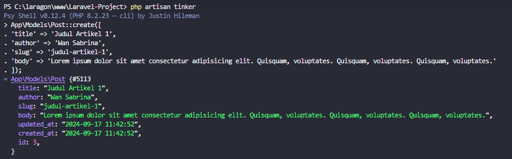

Data akan dimasukkan ke dalam tabel `posts`, dan field `created_at` serta `updated_at` akan diisi secara otomatis oleh Eloquent.

Karena Eloquent secara otomatis mengisi field `created_at`, kita bisa menggunakan data ini untuk menampilkan tanggal kapan post dibuat di view kita. Contoh penggunaan di view:

Menggunakan format tanggal tertentu:
```php
<a href="#">{{ $post['author'] }}</a> | {{ $post->created_at->format('j F Y')}}
```

Atau menggunakan waktu relatif:
```php
<a href="#">{{ $post['author'] }}</a> | {{ $post->created_at->diffForHumans()}}
```

#### Operasi Lain yang Bisa Dilakukan di Tinker

Selain memasukkan data, ada berbagai operasi lain yang bisa dilakukan di Tinker, seperti:

- Mengambil Semua Data:
    ```php
    App\Models\Post::all();
    ```

- Mengambil Data Pertama:
    ```php
    App\Models\Post::first();
    ```

- Mengambil Data Berdasarkan ID:
    ```php
    App\Models\Post::find(1);
    ```

- Menghapus Data:
    ```php
    $post = App\Models\Post::find(1);
    $post->delete();
    ```

- Mengupdate Data:
    ```php
    $post = App\Models\Post::find(1);
    $post->title = 'Updated Title';
    $post->save();
    ```

#### Membuat Model Beserta Migration Secara Otomatis

Selain membuat model secara manual, kita juga bisa membuat model beserta migration-nya secara otomatis dengan satu perintah. Berikut cara melakukannya:

- Buka terminal dan jalankan perintah berikut:
    ```bash
    php artisan make:model Post -m
    ```

Perintah ini akan membuat model `Post` dan juga migration untuk tabel `posts`. Kita dapat menemukan file migration yang baru dibuat di direktori `database/migrations`.

Setelah mendefinisikan struktur tabel `posts`, jalankan migration untuk membuat tabel di database:
```bash
php artisan migrate
```

## 5️⃣ Section 5
1. [Model Factories](#model-factories)
   - [Menggunakan Factories di Laravel](#menggunakan-factories-di-laravel)
   - [Membuat Factory Sendiri](#membuat-factory-sendiri)
   - [Menjalankan Migration](#menjalankan-migration)
2. [Eloquent Relationship & UI Update (Author Page)](#eloquent-relationship--ui-update-author-page)
   - [Menyesuaikan PostFactory untuk Relasi](#menyesuaikan-postfactory-untuk-relasi)
   - [Menambahkan Relasi di Model User dan Post](#menambahkan-relasi-di-model-user-dan-post)
   - [Menggunakan Relasi di Tinker](#menggunakan-relasi-di-tinker)
   - [Memperbaiki Tampilan di View Post](#memperbaiki-tampilan-di-view-post)
   - [Menambahkan Page/Route Author](#menambahkan-pageroute-author)
3. [Post Category & UI Update (Categories Page)](#post-category--ui-update-categories-page)
   - [Membuat Model, Migrasi, dan Factory untuk Category](#membuat-model-migrasi-dan-factory-untuk-category)
   - [Mengubah File Migrasi Category](#mengubah-file-migrasi-category)
   - [Mengubah File Migrasi Post](#mengubah-file-migrasi-post)
   - [Menambahkan Relasi Antar Model](#menambahkan-relasi-antar-model)
   - [Membuat Factory untuk Category dan Post](#membuat-factory-untuk-category-dan-post)
   - [Menghubungkan Kategori di Tampilan Post](#menghubungkan-kategori-di-tampilan-post)
   - [Menambahkan Route Categories](#menambahkan-route-categories)
4. [Database Seeder](#database-seeder)

>### Model Factories
Model Factories di Laravel adalah fitur yang memungkinkan kita untuk secara otomatis menggenerate data palsu (dummy) untuk model kita. Ini sangat berguna untuk testing dan seeding database dengan cepat tanpa harus memasukkan data secara manual.

#### Menggunakan Factories di Laravel
Di dalam direktori `database/factories`, Laravel secara otomatis membuat file `UserFactory.php`. File ini berisi definisi bagaimana data dummy untuk model User akan di-generate. Contoh isinya seperti berikut:

```php
public function definition(): array
{
    return [
        'name' => fake()->name(),
        'email' => fake()->unique()->safeEmail(),
        'email_verified_at' => now(),
        'password' => static::$password ??= Hash::make('password'),
        'remember_token' => Str::random(10),
    ];
}
```

- **`fake()`** adalah fungsi bawaan Laravel yang menggunakan library `Faker` untuk membuat data palsu yang tampak nyata, seperti nama, email, dan sebagainya.
- `fake()->name()` akan menghasilkan nama acak.
- `fake()->unique()->safeEmail()` akan menghasilkan email yang unik dan valid.
- `now()` mengisi field `email_verified_at` dengan waktu saat ini.
- `Hash::make('password')` membuat hash untuk string 'password'.

Untuk menggunakan UserFactory dan membuat data dengan Tinker bisa menjalankan commmand seperti berikut:
1. Buat satu user dengan factory:
    ```php
    App\Models\User::factory()->create();
    ```
2. Buat 10 user sekaligus:
    ```php
    App\Models\User::factory()->count(10)->create();
    ```
3. Menggunakan fungsi `unverified()` untuk membuat user tanpa `email_verified_at`:
    ```php
    App\Models\User::factory()->unverified()->create();
    ```

#### Membuat Factory Sendiri
Untuk membuat factory khusus untuk model lain, bisa membuatnya dengan perintah artisan:
```bash
php artisan make:factory PostFactory
```

Kemudian, isikan struktur factory sesuai dengan struktur tabel `posts`. Contohnya seperti berikut ini:

```php
public function definition(): array
{
    return [
        'title' => fake()->sentence(6),
        'author' => fake()->name(),
        'slug' => Str::slug(fake()->sentence()),
        'body' => fake()->text()
    ];
}
```
- `fake()->sentence(6)`: Menghasilkan sebuah kalimat yang terdiri dari sekitar 6 kata untuk judul.
- `fake()->name()`: Menghasilkan nama acak untuk penulis.
- `Str::slug(fake()->sentence())`: Menghasilkan slug unik berdasarkan kalimat acak.
- `fake()->text()`: Menghasilkan teks acak untuk isi posting.

Secara default, faker menggunakan data dalam bahasa Inggris (US). Namun, jika ingin menghasilkan data dalam bahasa atau format lokal tertentu, seperti Indonesia, bisa mengubahnya di file `.env`:

```env
APP_FAKER_LOCALE=id_ID
```

>### Eloquent Relationship & UI Update (Author Page)
Eloquent Relationships memungkinkan kita untuk mendefinisikan relasi antar tabel di dalam model menggunakan Eloquent ORM. Ini mempermudah pengelolaan dan pengambilan data yang terkait, seperti ketika kita ingin mengetahui siapa penulis dari sebuah postingan atau apa saja artikel yang pernah ditulis oleh seorang pengguna.

Untuk menghubungkan tabel `posts` dengan `users`, kita harus menambahkan kolom `author_id` ke dalam tabel `posts`. Ini dilakukan di file migration:

```php
public function up(): void
{
    Schema::create('posts', function (Blueprint $table) {
        $table->id();
        $table->string('title');
        $table->foreignId('author_id')->constrained(
            table: 'users',
            indexName: 'posts_author_id'
        );
        $table->string('slug')->unique();
        $table->text('body');
        $table->timestamps();
    });
}
```
- `foreignId('author_id')`: Menambahkan kolom `author_id` yang menjadi foreign key.
- `constrained('users')`: Menghubungkan `author_id` ke kolom `id` pada tabel `users`.

#### Menyesuaikan PostFactory untuk Relasi
Pada `PostFactory`, kita perlu menyesuaikan bagaimana cara mengisi `author_id` agar sesuai dengan relasi ke model `User`. Berikut adalah isinya:

```php
public function definition(): array
{
    return [
        'title' => fake()->sentence(6),
        'author_id' => User::factory(),
        'slug' => Str::slug(fake()->sentence()),
        'body' => fake()->text()
    ];
}
```
- `User::factory()`: Menggunakan factory `User` untuk membuat user baru dan secara otomatis menghubungkannya dengan `author_id`.

#### Menambahkan Relasi di Model User dan Post
Untuk mendefinisikan relasi antara `User` dan `Post`, kita perlu menambahkan method pada kedua model tersebut.

Di `User.php`:
```php
public function posts(): HasMany
{
    return $this->hasMany(Post::class, 'author_id');
}
```
- `hasMany(Post::class, 'author_id')`: Menandakan bahwa satu `User` bisa memiliki banyak `Post`.

Di `Post.php`:
```php
public function author(): BelongsTo
{
    return $this->belongsTo(User::class);
}
```
- `belongsTo(User::class)`: Menandakan bahwa satu `Post` hanya dimiliki oleh satu `User`.

#### Menggunakan Relasi di Tinker
Dengan relasi yang sudah ditetapkan, kita bisa melakukan operasi relasional menggunakan Tinker.

- Mengambil user beserta postingan mereka:
    ```php
    $user = App\Models\User::first();
    $user->posts; // Mengambil semua postingan user pertama
    ```
- Mengambil postingan dan mengetahui siapa penulisnya:
    ```php
    $post = App\Models\Post::first();
    $post->author; // Mendapatkan user yang menulis postingan ini
    ```
#### Memperbaiki Tampilan di View Post
Untuk menampilkan data relasi di view, kita modifikasi view `posts.blade.php` agar bisa menampilkan nama penulis dengan relasinya.

```blade
<a href="/authors/{{ $post->author->id }}" class="hover:underline">{{ $post->author->name }}</a>
``` 

#### Menambahkan Page/Route Author
Untuk menampilkan semua postingan oleh seorang penulis tertentu, kita tambahkan route baru:

```php
Route::get('/authors/{user}', function (User $user) {
    return view('posts', ['title' => 'Articles by ' . $user->name, 'posts' => $user->posts]);
});
```
- Menggunakan route model binding untuk mengambil `User` berdasarkan ID yang diberikan di URL.

Sehingga ketika kita mengklik nama author dari sebuah artikel, akan diarahkan ke page sebagai berikut:


Agar lebih aman, relasi `User` dengan `Post` dapat ditambahkan `username` pada tabel `users` pada file migrasi tabel user:
```php
public function up(): void
{
    Schema::create('users', function (Blueprint $table) {
        $table->id();
        $table->string('name');
        $table->string('username')->unique();
        $table->string('email')->unique();
        $table->timestamp('email_verified_at')->nullable();
        $table->string('password');
        $table->rememberToken();
        $table->timestamps();
    });
}
```

Tambahkan `username` pada user factory untuk membuat data acak.
```php
return [
    'name' => fake()->name(),
    'username' => fake()->unique()->username(),
    'email' => fake()->unique()->safeEmail(),
    'email_verified_at' => now(),
    'password' => static::$password ??= Hash::make('password'),
    'remember_token' => Str::random(10),
];
```
Sehingga pada url masing masing author, terlihat sebagai berikut:
 

>### Post Category & UI Update (Categories Page)

#### Membuat Model, Migrasi, dan Factory untuk Category
Untuk membuat model `Category` beserta file migrasi dan factory-nya secara bersamaan, kita dapat menggunakan perintah artisan berikut:

```bash
php artisan make:model Category -mf
```

Perintah ini akan menghasilkan tiga file sekaligus:
- Model `Category`
- File migrasi untuk tabel `categories`
- Factory `CategoryFactory`

#### Mengubah File Migrasi Category

Setelah membuat file migrasi untuk `categories`, kita perlu mendefinisikan struktur tabelnya. Dalam file migrasi tersebut, tambahkan kolom `name` dan `slug`:

```php
public function up(): void
{
    Schema::create('categories', function (Blueprint $table) {
        $table->id();
        $table->string('name');
        $table->string('slug')->unique();
        $table->timestamps();
    });
}
```

#### Mengubah File Migrasi Post

Selanjutnya, kita akan memperbarui migrasi untuk tabel `posts` agar dapat terhubung dengan tabel `categories`. Tambahkan `category_id` sebagai foreign key yang terhubung ke tabel `categories`:

```php
public function up(): void
{
    Schema::create('posts', function (Blueprint $table) {
        $table->id();
        $table->string('title');
        $table->foreignId('author_id')->constrained(
            table: 'users',
            indexName: 'posts_author_id'
        );
        $table->foreignId('category_id')->constrained(
            table: 'categories',
            indexName: 'posts_category_id'
        );
        $table->string('slug')->unique();
        $table->text('body');
        $table->timestamps();
    });
}
```

#### Menambahkan Relasi Antar Model

Untuk menghubungkan model `Category` dengan `Post`, kita tambahkan relasi `hasMany` di model `Category` untuk menunjukkan bahwa satu kategori dapat memiliki banyak post. Berikut ini adalah kode relasinya di dalam model `Category`:

```php
public function posts(): HasMany {
    return $this->hasMany(Post::class);
}
```

Kemudian, tambahkan relasi `belongsTo` di model `Post` untuk menunjukkan bahwa setiap post memiliki satu kategori:

```php
public function category(): BelongsTo {
    return $this->belongsTo(Category::class);
}
```

#### Membuat Factory untuk Category dan Post

Untuk menghasilkan data kategori acak, kita bisa menggunakan factory. Pada `CategoryFactory`, tambahkan kode untuk membuat data `name` dan `slug` secara acak:

```php
public function definition(): array
{
    return [
        'name' => fake()->sentence(rand(1, 2), false),
        'slug' => Str::slug(fake()->sentence(rand(1, 2), false))
    ];
}
```

Kemudian, pada `PostFactory`, tambahkan `category_id` untuk menghubungkan post dengan kategori yang dibuat oleh factory:

```php
public function definition(): array
{
    return [
        'title' => fake()->sentence(6),
        'author_id' => User::factory(),
        'category_id' => Category::factory(),
        'slug' => Str::slug(fake()->sentence()),
        'body' => fake()->text()
    ];
}
```

#### Menghubungkan Kategori di Tampilan Post

Agar kategori ditampilkan pada setiap post di halaman web, kita perlu memperbarui tampilan `posts.blade.php`. Tambahkan bagian untuk menampilkan nama kategori dan link-nya:

```php
<div>
    By
    <a href="/authors/{{ $post->author->username }}" class="hover:underline text-base text-gray-700">{{ $post->author->name }}</a> 
    In
    <a href="/categories/{{ $post->category->slug }}" class="hover:underline text-base text-gray-700">{{ $post->category->name }}</a> | {{ $post->created_at->diffForHumans()}}
</div>
```

#### Menambahkan Route Categories


Agar kita bisa menavigasi ke halaman kategori tertentu, kita tambahkan rute baru di `web.php` yang digunakan untuk menampilkan semua artikel dalam kategori tertentu berdasarkan `slug`:
```php
Route::get('/categories/{category:slug}', function (Category $category) {
    return view('posts', ['title' => 'Articles in Category: ' . $category->name, 'posts' => $category->posts]);
});
``` 

>### Database Seeder
